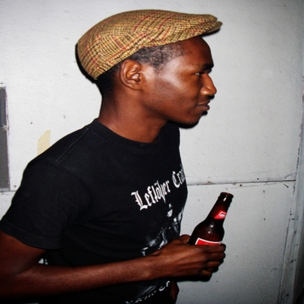
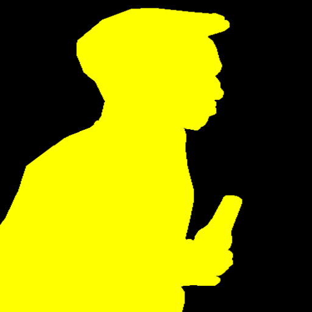
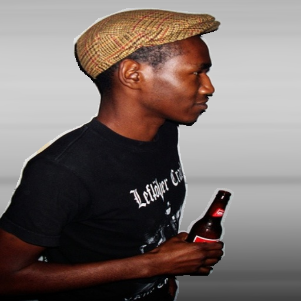

# Introduction 
This repo is using Unet architecture to do semantic segmentation: [Unet](https://arxiv.org/abs/1505.04597)

The dataset for training is [Pascal Voc](http://host.robots.ox.ac.uk/pascal/VOC/voc2012/index.html#voc2012vs2011)

The customized dataset is included in this repo 

## The customized unet architecture
In the encoder part I used Resnet18 to do the convolutional task and the rest is as same as the original Unet papers 

The model was trained on customized VOC pascal dataset, the original has 20 classes for instance segmentation but this customized dataset has only 2 classes (0- for the background, 1- for the objects) for the purpose of background removing

### Reference
The converting the 3 channel masks to the segmentation map and vice versa is the job of @meetshah1995, thanks @meetshah1995 for posting the code to github, that's really useful to my project

The augmentation process is also the job of mr @ptrblck from pytorch disscuss forum, thank you for your kindness.

### Backgroud removing
My idea on doing background removing is to blur the background pixels and retain the object pixels, this is done by doing semantic segmentation with only 2 classes. And the pixels classified as background will be blurred

## Image

## Mask 

## Blurred

